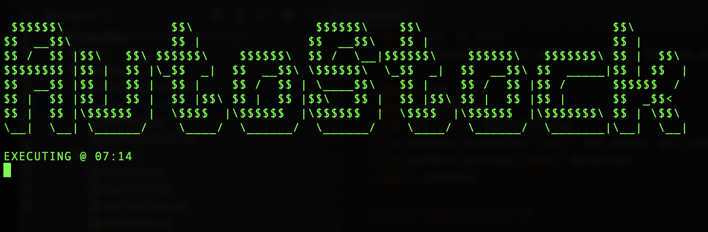

# TradeAlgo

TradeAlgo is a stock trading algorithm which places orders on penny stocks which will rise from market open to market close.
I developed this to assist with my passion for stock trading which founded in January of 2021 and my desire to become a Quant.

# How does it work?

TradeAlgo uses web scraping to pull a list of stocks which are predicted to rise already. After the list is scraped, each symbol is then
checked to validate if they match the parameters set in the code. (These parameters are created by me after extensive research on how to predict a rising stock)

After this, the total balance of your TD Ameritrade account is pulled using the TD Ameritrade API and your total balance is split among the stocks which matched the set 
parameters. You can change how much money from your account is allocated to be used with the algorithm by changing `balance` at line 63 in `operations/buyShares.py` to
the desired amount.

Finally, the buy function is called to execute all orders with a trailing stop loss to ensure minimal losses.

# How do I set it up?

In `secret/config.py`, you will need to set your information in each variable. You will notice there is a variable called `key`. This variable is your API key for TD Ameritrade's Developer application. In order to make one of these, you will need to register an account at https://developer.tdameritrade.com/. Then, create a new app and wait for it to be approved. (If you are confused about the callback url, just set it to http://localhost) Once it is approved, you can add that API key to your `key` variable. After that, you will need to set your security questions and their answers in `getData/getToken.py` line 50, 54, 58, 62, 48, 52, 56, and 60 because the login process to your account is automated with chromedriver in order to get your `access_token` to execute TD Ameritrade functions on your account.

You will also need to change your chrome driver paths in the code to match your systems path.

# Usage

To run the program, make sure everything is set up properly (including all libraries installed) and you are in the `operations` directory. You may adjust your `STARTTIME` and
`TOKENTIME` values as you please. This will control the time you get your token and when you execute your buying program. It's important to set `TOKENTIME` a couple minutes 
earlier than `STARTTIME` because it takes a few minutes to get the token which is NEEDED to run the buying program.

Then, run:
```
python buyShares.py

or

python3 buyShares.py
```

If you would like to sell everything before market close, you may run:
```
python sellShares.py

or

python3 sellShares.py
```

If everything is done properly, you should see something like this:



**If you only want to see a list of stocks that are recommended by the algorithm:** 

```
python list.py

or

python3 list.py
```

This will return a list of stocks that would have been purchased if you were to run `buyShares.py`

# Reddit Posts

[**r/wallstreetbets Post**](https://www.reddit.com/r/wallstreetbets/comments/mubgbg/a_14_yearolds_take_on_algorithmic_stock_trading/)
[**r/algotrading Post**](https://www.reddit.com/r/algotrading/comments/mubrws/a_14_yearolds_take_on_algorithmic_stock_trading/)

# Wrap-Up

Thanks for using my code!

If you would like to contribute, please make pull requests or email me at <vinay@vinayven.com>.


©Vinay Venkatesh 2021
